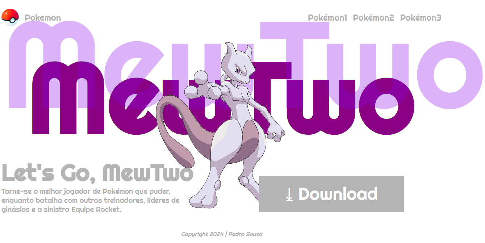

# landing page - let's go, pikachu

---

# sobre
site do tipo landing page para divulgar o jogo let's go, pikachu. o intuito deste projeto e colocar em pratica o conhecimento adquirido sobre as linguagens de marcaçao, HTML, CSS e Markdwon, realizadas no curso tecnico de desenvolvimento de sistemas [SENAI Jandira](https://sp.senai.br/unidade/jandira/)

---

## Tecnologias Utilizadas
-HTML
-CSS
-Markdwon
-git

---

## Autor
- [Pedro Souza]()
